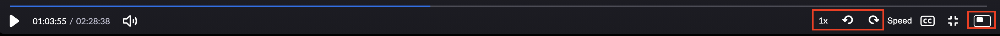

# &nbsp;&nbsp;Zoom Controls 

The Zoom recorded video player lacks any keyboard shortcuts to control the video. This extension adds those keyboard controls plus offers some additional features like variable playback rates.

## Features
### Added Controls
- Picture-in-Picture Mode
- Rewind/Forward
- Playback Indicator

### Keyboard Shortcuts
- Volume Up - **Arrow &#8593;**
- Volume Down - **Arrow &#8595;**
- Rewind - **Arrow &#8592;**
- Forward - **Arrow &#8594;**
- Play/Pause - **Spacebar  <svg height="10pt" viewBox="0 -161 514.42745 514" width="15pt" xmlns="http://www.w3.org/2000/svg"><path d="m482.277344 193.125h-450.125c-17.765625 0-32.152344-14.390625-32.152344-32.152344v-112.53125c0-26.636718 21.589844-48.226562 48.226562-48.226562 26.640626 0 48.230469 21.589844 48.230469 48.226562v48.226563h321.515625v-48.226563c0-26.636718 21.589844-48.226562 48.226563-48.226562s48.226562 21.589844 48.226562 48.226562v112.53125c0 17.761719-14.386719 32.152344-32.148437 32.152344zm0 0" fill="white"/></svg>**
- Mute/Unmute - **M**
- Full Screen - **F**
- Video Speed Increase (Playback) - **>**
- Video Speed Decrease (Playback) - **<**

 

## Download
Zoom Controls is now available to download from the [Google Chrome Store](https://chrome.google.com/webstore/detail/zoom-controls/henmmblkopelpkajjhhndaicecnccgff).

## To-Do
- [x] Add Playback Rate Indicator
- [ ] Add Playback Rate Icon/Controls
- [x] Add Picture-in-Picture Mode